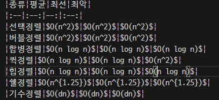

# iot_algorithm_2025
iot 개발자 자료구조와 알고리즘(코딩테스트 포함)

### 9일차 : 2월 13일
- 자료구조와 알고리즘 소개
1. 자료구조 : 데이터를 구성하고 효율적으로 관리하는 형태
    - 자료구조 종류
        - 단순 : 정수, 실수 ,문자, 문자열
        - 선형 : 배열, 리스트, 스택, 큐
        - 비선형 : 트리, 그래프
        - 파일 : 순차, 색인, 직접

2. 알고리즘 : 문제를 해결하는 논리적인 방법, 순서
    - 알고리즘 성능
        - 빅오 표기법
            - $O(1)$ : 데이터 수에 관계없이 항상 일정한 시간이 걸리는 것
            - $O(log n)$ : 단순 for문인데 전체 중 일부만 처리하는 것
            - $O(n)$ : 단순 for문
            - $O(n log n)$ : 이중 for문인데 안쪽 for문이 전체 중 일부만 처리
            - $O(n^2)$ : 이중 for문
            - $O(n^3)$ : 삼중 for문
            - $O(2^n)$ : 팩토리얼 등등 ...

- 리스트 
    - 생성, 값할당, 인덱싱, 슬라이싱
    - 내장함수 
        - 리스트명.copy() 
        - del(리스트명[index]) , 리스트명.remove(value), 리스트명.clear()
            - remove(value)일 때, value가 리스트에 여러개라면 인덱스 작은 것부터 제거된다.
            - `리스트명.clear()하면 데이터 다 날라갈 수 있으니 리스트명 =[]으로 하기`
        - 리스트명.append(value) , 리스트명.extend([2,3]) 
- 2차원리스트
 ```python
    matrix=[[1,2,3,4],
        [5,6,7,8],
        [9,10,11,12]]
    # 행
    matrix[2]
    # 열
    b = [i[3] for i in matrix]
 ```
- 문자열포맷팅
    - `:2d , :>3d(3자리, 오른쪽 정렬)`
    ```python
    print(f'{list2[i][j]:<3d}', end=' ')
    ```

### 10일차 : 2월 14일
- 파이썬 기초 문법
    - 리스트 컴프리헨션 [노트북](./day10/da01_list.ipynb)
        - 배수, 2차원리스트 

- 자료구조
    - 선형 리스트 [노트북](./day10/da02_linear_list.ipynb)
         - 배열이라고 가정하면, 빈공간을 만들고 shift시켜야함.
    - 단순 연결리스트 [노트북](./day10/da04_linked_list.ipynb)

### 11일차 : 2월 17일 
- 연결리스트 :  [파이썬](./day11/da01_linked_list.py)
    - 연결리스트 실습 : 주소록 [파이썬](./day11/da02_linked_list_practice.py)
    - 이중연결 리스트 : 앞에서 검색, 뒤에서 검색 용이
    - 원형 리스트 : 시작노드 변경시 오버헤드 없음 [파이썬](./day11/da02_circle_list_practice.py)
    - 파이썬 list() : 연결리스트와 유사    

- 스택 : [노트북](./day11/da03_stack.ipynb)
    - 스택 실습 : 웹사이트 방문 기록 [파이썬](./day11/da04_stack_practice.py)
    - 알고리즘 DFS(깊이우선탐색) 시 사용
- 큐 : [노트북](./day11/da04_queue.ipynb)


### 12일차 : 2월 18일 
- 백준 코딩 
    - `문자열 : 역순은 슬라이싱 [::-1] `
    - 큐 , 스택

- 큐 [파이썬](./day12/da01_queue.py)
    - `전역변수로 선언한 변수들을 def() 함수 내에서 값을 변경해야 할 때, global을 쓴다.`
    - 스택의 peek() : stack[top]
    - 큐의 peek() : queue[front+1]
    - BFS(너비우선탐색) 시 사용

- 원형큐 [노트북](./day12/da02_circle_queue.ipynb)
    
- 이진트리 [파이썬](./day12/da03_binary_tree.py)
    - 종류
        - 포화 이진 트리 : 모든 노드의 차수가 2인 것 
        - 완전 이진 트리 : 
        - 일반 이진 트리 :
        - 편향 이진 트리 : 
    
    - 순회 [노트북](./day12/da03_binary_tree.ipynb)
        - 전위순회
        - 중위순회
        - 후위순회

### 13일차 : 2월 19일 
- deQue(데크) [노트북](./day11/da04_queue.ipynb)
    ```python
    # deque(데크) collections에서 임포트
    from collections import deque
    ```
    - 큐(append, popleft), 스택(append, pop) 구현 

- 리스트, append(push와 동일), pop으로 스택을 구현가능

- 그래프 (day13폴더 내 txt파일 참고)
    - 방향, 무방향 , 가중치
    - 인접행렬 표현 [노트북](./day13/da01_graph.ipynb)
        - 의미 없는 값도 행렬에 저장되니 비효율적
        - 무방향의 경우, 대각선을 기준으로 대칭
    - 깊이 우선 탐색 [파이썬](./day13/da02_dfs.py)
        - 스택, 방문기록 리스트
    - 신장 트리 [파이썬](./day13/da03_min_cost_spannigtree.py)
        - 최소간선 : 정점의 개수 - 1

- 재귀호출
    - 점화식 
        - $S(n) = n + S (n-1) , S(1) =1$
        - $F(n) = n * F(n-1) , F(1)= 1, F(0) = 1$


### 14일차 : 2월 20일 
- markDown에서 테이블 만들기 
    - --(왼쪽정렬) --:(오른쪽정렬) :--: (중앙정렬)
    
    
- 재귀호출 연습
    - 배열의 합산 ,회문판단 [노트북](./day14/da01_recursive_practice.ipynb)
    - fractal , 시에르핀스키 삼각형 [파이썬](./day14/da02_fractal02.py)
    
- 정렬 [노트북](./day14/da04_sort.ipynb)
    - [정렬시각화 참고사이트](https://visualgo.net/en/sorting)
    - 선택정렬 [파이썬](./day14/da04_sort_practice01.py)
    - 삽입정렬 [파이썬](./day14/da04_sort_practice02.py)
    - 버블정렬 , 버블 정렬 시간복잡도 최선O(n)


 
### 15일차 : 2월 21일   
- 정렬
    - 퀵정렬
    - 정렬 알고리즘 응용

- 동적 계획법

### 16일차 : 2월 24일  
- 검색
- 코딩 테스트